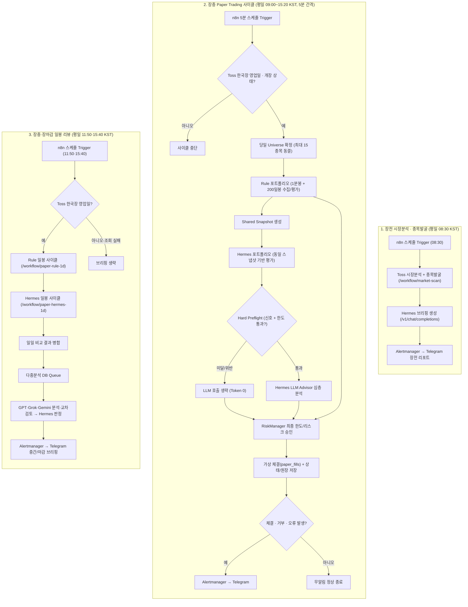

# Toss Trader 자동매매 시나리오

paper cycle의 신호·진입·청산 상태기계는
[`paper-cycle-flow.md`](paper-cycle-flow.md)를 기준으로 한다.
프로젝트 핵심 용어 정의는 [`glossary.md`](glossary.md)를 참고한다.

## 현재 범위

현재 시스템은 **paper trading 전용**이다.

- `TRADING_ENABLED=false` 고정
- 실제 주문 생성·정정·취소 코드 없음
- 전략 신호가 승인되어도 DB에 가상 체결만 기록
- Hermes는 한도 통과 신호만 승인/거부. 최종은 RiskManager
- 실주문 전환은 별도 구현·검증·명시적 승인 필요

## 전체 흐름



n8n이 전체 자동화의 단계 순서와 실패 전파를 담당한다. workflow는
[`automation/n8n/toss-trader-market-scan.json`](../automation/n8n/toss-trader-market-scan.json)과
[`automation/n8n/toss-trader-intraday-paper.json`](../automation/n8n/toss-trader-intraday-paper.json),
[`automation/n8n/toss-trader-daily.json`](../automation/n8n/toss-trader-daily.json)에
있고 공통 실패 처리는
[`automation/n8n/toss-trader-error.json`](../automation/n8n/toss-trader-error.json)이
담당한다. 저장소 JSON의 `active=false`는 import 안전 기본값이며 운영 n8n에서는
관련 workflow가 publish되어 활성 상태다. 각 workflow의 평일 스케줄과 수동
trigger가 같은 내부 API를 호출한다.

automation API는 원자 작업만 제공한다. workflow JSON에는 credential ID만 있고,
n8n encrypted credential DB에는 Hermes bearer·RiskManager bearer·수동 webhook bearer가
저장된다. n8n은 `openclaw-net`에서 다음 단계를 조립한다.

- 장전: `market-scan` → Hermes 직접 호출 → `hermes-market-result` → `report-market`
- 장중: `paper-rule-1m` → `paper-hermes-1m` → 병합 → `report-paper`
- 중간·마감: `paper-rule-1d` → `paper-hermes-1d` → `daily-panel-enqueue` → 다중분석 panel → Telegram
- 실패: Error Trigger → `report-failure`

Toss·Alertmanager credential은 automation의 Infisical 주입값을 사용한다. Hermes
bearer는 n8n이 직접 호출하므로 n8n encrypted credential에도 저장된다. 어느 경우든
workflow JSON과 Git에는 secret을 저장하지 않는다.

## 일일 실행 시나리오

### 1. 장전 시장분석·종목발굴

- 평일 `08:30 KST` 실행
- `MARKET_BENCHMARK_SYMBOLS`의 일봉 60개로 시장 상태 판정
- `DISCOVERY_SYMBOLS`의 일봉 60개로 후보 순위 계산
- 결과를 `TossTraderMarketScan`으로 Telegram topic에 전송
- 주문이나 paper 체결은 하지 않음

시장 상태 규칙:

| 상태 | 조건 |
|---|---|
| `RISK_ON` | 종가 > MA20 > MA60, 20일 모멘텀 양수 |
| `RISK_OFF` | 종가 < MA20 < MA60, 20일 모멘텀 음수 |
| `NEUTRAL` | 그 외 |

종목 후보는 `종가 > MA20 > MA60`이고 20일 모멘텀이 양수인 종목만 포함한다.
점수는 `20일 모멘텀(%) + 최근 거래량/20일 평균 거래량`이며 상위
`DISCOVERY_TOP_N`개를 보낸다. 현재 구현은 KRX 전체 자동 열거가 아니라 명시된
discovery universe 안에서 발굴한다.

### 2. 장중 paper cycle

- 평일 `09:00~15:20 KST`, 5분 간격 실행
- n8n이 `paper-rule-1m`, `paper-hermes-1m` task를 순차 호출
- task endpoint는 host port 없이 `openclaw-net` 내부에서만 접근
- 종목별 1분봉과 완결 일봉 200개 수집
- 직전 완결 일봉의 setup-v2.3 후보를 D+1 첫 완결 1분봉에서 arm. PIT 수급
  6세션은 필수지만 외국인 반전은 가점이며 미반전만으로 차단하지 않음
- 보유 포지션은 persisted stop·structure invalidation으로 SELL 관리
- Rule은 Hermes 없음. Hermes는 신호+한도 통과 때만. 한도 거부는 판단 행만
- 정상 무신호는 Telegram을 보내지 않음
- 체결, 의미 있는 RiskManager 거부, 종목/API 오류만 즉시 보고
- 동일 cycle 중복 요청은 `409`, 동일 캔들 신호는 `duplicate-signal`로 차단

장 마감 10분 전부터 신규 매수는 RiskManager가 거부한다. 매도는 허용하지만
휴장일에는 stale candle 체결을 방지하기 위해 양 방향 모두 거부한다.

### 3. 중간·마감 n8n 실행

- 한국장 영업일 `11:50`, `15:40 KST` 실행. 휴장·calendar 오류에는 생략
- HTTP timeout: 10분
- 같은 작업이 이미 실행 중이면 automation API가 `409` 반환
- endpoint는 host port로 공개하지 않고 `openclaw-net`에만 노출
- 분석 panel은 1d cycle 수익률만 보지 않는다. 같은 서울 일자 `1m`
  `cycle_insight`를 모아 `intradayReview`/`dailyReview`로 넘긴다. 판단 기준은
  규칙 준수(setup 차단, 시가 대기, 보유 idle, 체결)이지 당일 플러스가 아니다.
  11:50 결과는 `midday` 비확정 관측으로 표시하며 종가·일일 성과를 확정하지 않는다.
  뉴스·사후 해석으로 놓친 매수를 지어내지 않는다.

### 4. Toss paper cycle

n8n의 각 task 호출마다 automation service가 별도 프로세스로
`run-paper-cycle --portfolio rule` 또는
`run-paper-cycle --portfolio hermes --hermes-advisor`를 실행한다. 자식
프로세스에도 `TRADING_ENABLED=false`를 강제로 넣는다.

두 신규 포트폴리오는 각각 독립된 1,000,000원으로 시작한다. 기존 시험 체결은
삭제하지 않고 `legacy` 포트폴리오로 보존하며 비교 성과에는 포함하지 않는다.
`paper_portfolios`가 표시 이름·mode·초기자금을 저장하고, `paper_fills`,
`paper_risk_decisions`, `paper_cycle_runs`는 `portfolio_id`로 격리한다.

Hermes: 로컬 hard preflight 통과 후에만 advisor. 한도 거부 → 판단 1행, token 0.
Rule: preflight 없이 n8n 1회. advisor payload는 신호+RiskContext에 cycle이 이미
수집한 최근 완결 일봉 30개·분봉 60개·setup-v2·PIT 수급 요약을 붙인다. Hermes가
Toss API를 직접 조회하지 않는다. 뉴스·호가 없음.
장애는 `Hermes 분석 실패: 응답을 받지 못해 체결 차단`. token은 `hermes_trade`.

종목별 처리:

1. Toss OAuth 토큰 획득 또는 캐시 토큰 재사용
2. 장중 1m v2 cycle은 1분봉과 같은 종목의 일봉 200개를 수집한다. 완결 일봉이
   200개 미만이면 `setup-v2:missing:completed-daily-candles` skip이지
   종목 `error`가 아니다. Hermes shared snapshot이 후보를 다시 만들어도 같다.
3. 직전 완결 일봉의 가격 setup과 PostgreSQL PIT 수급 6세션·이벤트를 평가한다.
4. 다음 거래일 첫 완결 1분봉에서 3% 갭, stop, ATR, heat, cash로 BUY를 arm한다.
5. 기존 v2 포지션은 structure invalidation 또는 stop touch 다음 봉 시가로
   SELL 후보를 만든다.
6. BUY plan을 먼저 저장하고 국가별 정규장 일정과 시장 휴장 여부를 확인한다.
7. Hermes면 hard preflight → 통과 시 advisor → n8n Risk. Rule은 n8n Risk 1회
8. 승인 시 paper 체결 기록. 미체결 BUY plan은 제거하고 SELL 체결 plan도 종료
9. 손익을 다시 계산하고 cycle 결과·API 오류 수를 저장한다.

한 종목 실패는 다른 종목 처리를 막지 않는다. 일부 실패는
`partial_failure`, 전부 실패는 `failed`로 저장된다. 같은 캔들에서 생성된
동일 `signal_id`는 다시 체결되지 않는다.

RiskManager 판단은 `paper_risk_decisions`에 먼저 기록한다. 판단 저장이 실패하면
승인된 신호여도 paper fill을 만들지 않는 fail-closed 방식이다. cycle 실행
상태는 `paper_cycle_runs`, 가상 체결은 `paper_fills`에 저장한다.

### 5. 리스크 검사

기본 제한:

| 검사 | 제한 | 위반 코드 |
|---|---:|---|
| 1회 주문 금액 | 300,000원 | `max-order-notional` |
| paper 가용 현금 | 주문 금액 초과 금지 | `insufficient-paper-cash` |
| 종목별 보유 금액 | 1,000,000원 | `max-position-notional` |
| 일일 신규 매수 | 5회 | `max-daily-buys` |
| 동시 신규 포지션 | 10종목 | `max-open-positions` |
| 일일 수익률 | -3% 이하 신규 BUY 중단 | `daily-loss-limit` |
| 연속 API 오류 | 5회 이상 중단 | `api-error-kill-switch` |
| universe 갱신 실패 | 신규 BUY 금지, 보유 SELL 허용 | `universe-refresh-failed` |
| setup-v2 필수 입력 누락·금지필터 | 신규 BUY 금지, SELL 허용 | `setup-v2-block` |
| 휴장일 매수·매도 | 금지 | `market-closed` |
| 장 마감 전 신규 매수 | 10분 전부터 금지 | `market-close-window` |
| 동일 신호 | 재체결 금지 | `duplicate-signal` |
| 보유량 초과 매도 | 금지 | `insufficient-position` |
| RiskManager webhook 오류 | 체결 금지. preflight 아님 | `risk-manager-workflow-unavailable` |
| Hermes advisor 거부 | 한도 통과 후 | `Hermes 거부: <근거>` |
| Hermes advisor 오류 | 한도 통과 후 | `Hermes 분석 실패: 응답을 받지 못해 체결 차단` |

위 세 줄 제외가 hard preflight. 매도는 보유 수량 안. 단일 통화 포트폴리오의
`daily_return_rate`는 UTC 일자 시작 총자산 대비 현재 총자산 변화이며, 체결
수수료·세금과 실현손익을 포함한다. 여러 통화가 동시에 열려 있으면 환율 변환
기준이 없으므로 기존처럼 통화별 보유 MTM 중 최저 수익률을 사용한다.

### 6. Hermes 분석

일일 보고에는 paper cycle JSON만, 시장분석 보고에는 규칙 기반 시장분석 JSON만
전달한다. 인증정보, 환경변수, 파일, 이전 대화는 전달하지 않는다. Hermes 역할:

- 결과, 신호, 가상 체결, 실패, 수익률 요약
- 한국어 평문 6줄 이내
- 매매 추천 금지
- 응답 최대 4,000자
- 시장분석 의견은 한국어 2~4문장으로 시장 간 엇갈림, 모멘텀, 거래량,
  후보 강도와 주의점을 해석
- 직접적인 매수·매도 지시와 확정적 수익 표현 금지

`HERMES_API_KEY` 하나를 Hermes의 `API_SERVER_KEY`와 Toss Trader의 bearer
token으로 같이 사용한다. 별도 Hermes 키는 필요 없다.

분석 전용 `hermes-analysis` sidecar를 다음 경계로 실행한다.

- `openclaw-net` 내부 `http://hermes-analysis:8642`에서만 접근
- bearer 인증 필수, host port publish 없음
- Docker socket과 host filesystem mount 없음
- `platform_toolsets.api_server`, plugin, MCP, context tool 모두 0개
- 인증된 `/v1/toolsets` 응답의 enabled/resolved tool이 모두 0개인지 검증
- 전용 named volume은 Hermes runtime data용이며 OAuth credential을 저장하지 않음

Docker socket을 가진 기존 공용 Hermes 컨테이너와 그 credential은 공유하지
않는다. system prompt의 “도구를 호출하지 마라” 문구는 보안 경계로 간주하지
않는다.

장중 token은 실제 advisor 호출만. 무신호·한도 거부는 0. 기록은 `automation_run_logs`.

### 7. Telegram 보고

성공 시 Hermes 요약을 `TossTraderDailyReport` alert로 Alertmanager에 보낸다.
실패 시 실패 stage(`cycle`, `hermes`, `report`)를 보고한다.

paper cycle JSON은 Hermes 호출 전에 규칙 기반으로 검사한다. 아래 이벤트가
있으면 `TossTraderPaperCycleNotice`를 별도 전송한다.

- paper 체결: `info`
- RiskManager 거부, 종목 처리 실패, Toss API 오류 연속: `warning`
- 일일 손실 -3% 이하, API 오류 5회 이상, 비정상 프로세스 종료: `critical`
- `duplicate-signal` 단독 거부는 정상 멱등 재실행으로 보고 제외
- `max-open-positions` 단독 거부는 슬롯 한도 반복이므로 보고 제외. 판단 기록은 유지
- 특이사항 전송 실패도 Hermes 일일 분석과 기존 일일 보고는 계속 실행

- destination: `TELEGRAM_CHAT_ID`
- forum topic: `TELEGRAM_TOPIC`
- 일일 보고는 `send_resolved=false`
- 시장분석·종목발굴 보고도 `send_resolved=false`
- paper cycle 특이사항도 `send_resolved=false`
- 일반 장애 alert는 firing/resolved 모두 전송

### 8. Telegram 질의

Alertmanager 보고와 별개로, 운영자는 공용 Hermes Telegram에 paper 진행·보유·
손익을 물을 수 있다. 공용 Hermes는 `openclaw-net`의 `paper-mcp`만 호출한다.
`toss_paper_status`는 신호 수뿐 아니라 `idleReason`·종목별 MA 상태·현금을
같이 준다. 2026-08-14 추가. 분석 sidecar `hermes-analysis`에는 tool이 없다.

상세와 등록 명령은 [`paper-mcp.md`](paper-mcp.md)를 따른다.

## 모니터링 시나리오

Prometheus가 다음 상태를 감시한다.

- metrics endpoint 5분 중단
- 완료된 paper cycle 없음
- 마지막 cycle 실패 또는 부분 실패
- API 오류 3회 이상 연속
- paper 일일 손실 -3% 이하
- 완료 cycle이 25시간 이상 오래됨

Grafana는 Tailscale 주소로만 접근한다. 현재 기본 port:

| 서비스 | Port |
|---|---:|
| Metrics | `9108` |
| Prometheus | `19090` |
| Alertmanager | `19093` |
| Grafana (공용) | `3001` |

Grafana `Toss Trader`: 상태 패널 `toss-prometheus`, 장부 `toss-postgres` (SELECT only).
한도 거부는 `paper_risk_decisions`만. `Hermes Automation Run Log`에는 advisor 호출만.
Telegram에서 진행·보유·손익을 묻는 경로는 [`paper-mcp.md`](paper-mcp.md).

## 장애 처리

| 장애 | 동작 |
|---|---|
| Toss 랭킹 오류 | 동적 universe 실패 기록, 보유 종목만 추적, 신규 BUY 거부 |
| Toss 인증/시세 오류 | 종목 실패 기록, 오류 streak 증가, 나머지 종목 계속 |
| MA 계산 이력 부족 | 종목별 제외 사유 기록, cycle 실패·API 오류로 집계하지 않음 |
| 신규 보유종목의 이전 일봉 없음 | paper 체결 원가와 최신 1분봉으로 당일 손익 평가 |
| 시장 일정 조회 실패 | 해당 국가 신호 실행 금지 |
| RiskManager 거부 | 체결 없음, 위반 코드 기록 |
| paper cycle 비정상 종료 | Hermes 단계 생략, 실패 alert 시도 |
| Hermes 오류/timeout | 기계적 의견으로 대체하지 않고 `hermes` 단계 실패 alert 전송 |
| Alertmanager 오류 | API가 `502` 반환, n8n execution 실패 기록 |
| 중복 실행 | 두 번째 요청 `409` 반환 |

장중 cycle 실패 알림은 생성된 종목별 원인을 Alertmanager에 그대로 전달한다.
상세 분석이 있는 실패를 `unknown: failed`로 대체하지 않는다.

## 필요한 Infisical 키

값은 저장소나 Compose 파일에 기록하지 않는다. Infisical `prod`, path `/`에서
주입한다.

```dotenv
TOSS_CLIENT_ID=
TOSS_CLIENT_SECRET=
TOSS_ACCOUNT_SEQ=

POSTGRES_HOST=
POSTGRES_PORT=5431
POSTGRES_USER=
POSTGRES_PASSWORD=
POSTGRES_DB=

GRAFANA_ADMIN_PASSWORD=
TELEGRAM_BOT_TOKEN=
TELEGRAM_CHAT_ID=
TELEGRAM_TOPIC=
HERMES_API_KEY=
N8N_RISK_MANAGER_TOKEN=
N8N_MANUAL_TRIGGER_TOKEN=
```

시장분석·발굴 설정은 비밀이 아니다. 값이 없으면 Compose 기본값을 사용한다.

```dotenv
MARKET_BENCHMARK_SYMBOLS=069500,229200
DISCOVERY_SYMBOLS=005930,000660,373220,207940,005380,000270,068270,105560,055550,035420,035720,006400,051910,028260,012330
DISCOVERY_TOP_N=10
DYNAMIC_UNIVERSE_CANDIDATE_COUNT=30
DYNAMIC_UNIVERSE_RANKING_FETCH_COUNT=100
DYNAMIC_UNIVERSE_SIZE=15
CANDLE_REQUEST_INTERVAL_SECONDS=0.25
```

장중 paper cycle은 고정 watchlist를 사용하지 않는다. 서울 12:00 KST 전에는
Toss 실시간 거래대금 랭킹을 최대 100개 조회한다. 12:00 KST부터는 KRX
전일 `ACC_TRDVAL`(유가 `stk_bydd_trd` + 코스닥 `ksq_bydd_trd`) 상위 100개로
바꾼다. 오전 Toss cache는 오후에 재사용하지 않는다. KRX 실패는 Toss로
폴백하지 않는다. 투자유의 종목은 Toss 요청에서
제외하고, metadata의 STOCK·보통주·ACTIVE·거래정상 종목만 `eligible_rank`를
다시 매겨 상위 30개를 평가한다. `TOP_GAINERS`는 선정에 사용하지 않는다.
직전 완결 일봉 200개가 있는 적격 종목을 최대 15개까지 당일 고정한다. 가격
setup 미달은 membership 탈락이 아니다. 선정 0종은 성공이지만 freeze하지 않고
다음 cycle에서 다시 뽑는다. 랭킹·metadata·가격
데이터 오류는 실패로 기록하고 성공 cache 없이 재시도한다. 주문 한도·가용 현금·
일일 손실·API 오류 streak는 membership이 아니라 BUY 실행 Risk에서 검사한다.
종목 유형·보통주·거래 상태·기준가 membership은 로컬 순수 검증으로 처리해
후보 최대 100개를 n8n으로 순차 호출하지 않는다.
기존 보유 종목은 별도로 계속 추적한다.
판단은 `dynamic_universe_runs`, `dynamic_universe_decisions`에 저장한다.
universe가 갱신된 시점에는 선정 종목 중 `MA20 > MA60`인 기존 상승 추세도
최초 BUY 신호를 만들 수 있다. 같은 universe run의 신호 ID는 고정해 중복 체결을
막는다. 장중 1분봉은 그 밖에도 일봉 `RISK_ON`이고 1분 상승 정렬인 미보유
종목에 하루 1회 continuation 매수를 허용한다. RiskManager는
하루 BUY 5건과 동시 보유 5종목을 상한으로 적용하고 모든 승인을 장부에 남긴다.

선정 종목의 `/candles`는 종목별 순차 조회한다. 호출 사이에는 기본 0.25초를
두고, Toss의 `X-RateLimit-*`와 `Retry-After` 응답에 따라 대기를 늘린다.
전략 window, 수량, port와 위 설정은 비밀이 아닌 일반 설정이다.

## Toss 허용 IP

OAuth token 발급과 별개로 Toss WTS의 `설정 → Open API → 허용 IP 관리`에
실행 서버의 외부 IPv4를 등록해야 한다. 미등록 IP에서 데이터 API를 호출하면
`403 edge-blocked`가 발생한다.

회선의 공인 IP가 바뀌면 WTS 허용 IP도 갱신해야 한다. 특정 IP를 문서에 고정하지
않고 배포·장애 시점에 실행 서버와 WTS 설정에서 현재 값을 확인한다. Tailscale IP나
내부 LAN IP를 등록하는 것이 아니다.

## 실주문 전환 조건

현재 버전은 실주문을 지원하지 않는다. 향후 전환 순서:

1. paper trading 2~4주 운영
2. 중복 신호, 장애 복구, 휴장일, 손실 제한 검증
3. live executor를 paper executor와 별도 모듈로 구현
4. 주문 전 계좌·매수가능금액·매도가능수량 재검사
5. `clientOrderId` 기반 주문 멱등성 적용
6. dry-run 결과와 주문 payload 대조
7. 운영자 명시적 승인 후 1주 micro-live
8. 별도 kill switch와 일일 한도 검증 후 자동화

`TRADING_ENABLED=true` 하나만으로 실주문이 가능해지면 안 된다. 명시적 live
모드, 주문 한도, 계좌 확인, 멱등성 검사를 모두 통과해야 한다.
