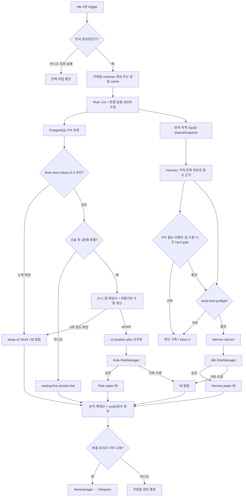

# Paper cycle flow

이 문서는 다음 세션 배포 예정인 setup-v2.3 paper cycle의 기준 설명이다. 시스템은
`TRADING_ENABLED=false`이며 PostgreSQL에 가상 판단·체결만 기록한다. 증권사
실계좌 주문은 생성하지 않는다.

## Daily schedule

| 시각(KST) | 실행 | 역할 |
|---|---|---|
| 평일 08:30 | market scan | 장전 후보 분석·Telegram 리포트. 체결 없음 |
| 평일 09:00~15:20, 5분 간격 | Rule 1m → Hermes 1m | 같은 시장 snapshot으로 독립 paper 장부 비교 |
| 평일 11:50 | Rule 1d → Hermes 1d → midday review | 현재까지의 1m 퍼널·체결·위험과 저장된 시세 대비 중간 브리핑. 마감 확정 아님 |
| 평일 15:40 | Rule 1d → Hermes 1d → daily review | 당일 1m cycle 퍼널·체결·규칙 준수와 시세 대비 마감 리뷰 |

모든 schedule은 먼저 Toss 한국장 calendar를 확인한다. 휴장 또는 calendar 조회
실패면 이후 scan, cycle, Hermes, Telegram 작업을 실행하지 않는다.

## One intraday cycle

Rule이 시장 데이터를 한 번 수집해 `sharedSnapshot`을 만든다. Hermes는 Rule
선정종목과 정적 적격·유동성 후보를 합친 최대 30종의 같은 저장 시세를 재사용한다.
Hermes는 가격 셋업·RSI·낙하 칼날 판정을 참고 근거로 보지만, 필수 데이터·이벤트·
갭·수량·시간·Risk는 우회하지 못한다. 후보와 전략 계약이 달라 직접 A/B가 아니다.

## Universe and market snapshot

1. 서울 거래일에 `official:d1-known-pool` 성공 universe가 있으면 0종을 포함해
   장중 같은 선택을 사용한다.
2. 08:35 KST에 Toss KR calendar로 직전 영업일을 찾고 KRX D-1 시세를 실제
   조회한 뒤 `market_symbols`와 교차해 D-1 거래대금 순으로 읽는다.
3. STOCK·보통주·ACTIVE·거래정상·유효 가격을 확인한 뒤 모든 종목의 직전 완결
   일봉 200개와 setup-v2.3 가격·PIT 수급·이벤트 조건을 평가한다. `TOP_GAINERS`와 장중 랭킹은
   entry 선정에 쓰지 않는다.
4. 가격 setup 통과자만 D-1 거래대금 순 `eligible_rank`를 매겨 최대 15개까지
   선택한다. 부족분을 채우지 않는다. 정상 0종도 당일 고정한다. 현금·수량·주문
   한도·일일 손실·API 오류는 BUY 실행 Risk에서만 검사한다.
5. Hermes collection pool은 Rule 선택을 먼저 보존하고, 가격 셋업 통과 여부와
   무관한 정적 적격·유동성 후보로 최대 30종을 채운다. ETF·우선주·정지·이력
   데이터 오류는 포함하지 않는다.
6. 순위 밖이어도 현재 보유 종목은 추적 대상에 포함한다.
7. 랭킹·metadata·가격 데이터 오류면 성공 cache를 만들지 않고 다음 cycle에서
   재시도한다. 가격 setup 통과 후보의 필수 PIT 수급·이벤트 결손도 정상 0종으로
   고정하지 않는다. 그동안 신규 BUY를 막고 기존 보유의 SELL 경로만 유지한다.
7. 종목별 1분봉과 완결 일봉 200개를 받고, 부족하면 `nextBefore` cursor가
   소진되거나 200개가 될 때까지 bounded pagination한다. cursor 무진전·페이지
   상한·부분 이력 뒤 빈 응답은 데이터 오류로 재시도한다. 정상 소진이 확인된
   완결 일봉 부족만 오류가 아닌
   `setup-v2:missing:completed-daily-candles(n/200)` skip이다.

## Setup-v2.3 candidate

후보는 오늘 장중 가격이 아니라 직전 완결 일봉까지의 200일 데이터로 만든다.
기존 MA 골든크로스가 BUY를 만들고 setup-v2가 뒤에서 거르는 구조가 아니다.

필수 입력:

- 가격: 200개 연속 완결 일봉, MA50·MA200·RSI14·ATR14
- 수급: 의사결정 시각에 이미 관측된 연속 6세션
- 이벤트: 해당 signal session의 OpenDART coverage
- 소스 우선순위: 같은 세션이면 KRX 공식 CSV → KIS first-observed
- 시간 규칙: `available_at <= decision_at`인 행만 사용

가격 setup은 pullback 또는 oversold reversal 중 하나가 필요하다. 수급은 연속
6세션 이력이 필수다. 최근 5세션 외국인 순매수 비율이 음수에서 양수로 전환하면
가점하고 기관 확인은 추가 강도로 쓴다. 미반전만으로 BUY를 차단하지 않는다.

다음은 신규 BUY를 차단한다.

- 수급 6세션 미달 또는 세션 불연속
- event coverage 없음, 임박 공시 존재
- 가격 setup 없음, RSI 과열, falling knife
- 물타기, stop 근접, 필수 입력 UNKNOWN

valuation tier는 기록하지만 현재 실제 수량 배수는 항상 `1.0`이다.

## D+1 entry and sizing

승인 후보는 다음 거래일 첫 정규장 1분봉이 완결될 때까지 대기한다. 첫 봉의
timestamp는 session open과 같아야 한다.

1. 첫 봉 시가가 signal close보다 3% 이상 높으면 `gap-up-chase`로 차단한다.
2. 구조적 stop은 setup 일봉 저가다.
3. 실제 stop 거리는 `max(시가-stop, ATR14 × 1.5)`다.
4. 진입·청산 각각 5bp 불리한 slippage와 국내 거래비용을 반영한다.
5. 수량은 다음 한도의 최솟값을 정수 주식 단위로 내림한다.

| 제한 | Rule | Hermes experimental |
|---|---:|---:|
| 1회 위험 예산 | equity의 0.5% | equity의 2% |
| 전체 open heat | equity의 2% | equity의 6% |
| cluster heat | equity의 1% | equity의 6% |
| 주문 금액 | 700,000원 | 700,000원 |
| 가용 현금 | 비용 포함 초과 금지 | 비용 포함 초과 금지 |

신뢰 가능한 sector master가 아직 없어서 모든 종목을 `UNKNOWN` 단일 cluster로
취급한다. Hermes의 6% cluster heat는 이 단일 UNKNOWN bucket 전체 한도다.
같은 cycle의 앞선 후보가 fill되기 전이라도 heat와 cash를 임시
예약해 뒤 후보의 중복 사용을 막는다. 계산 결과가 1주 미만이면 BUY하지 않는다.

## Position and exit state machine

BUY 직전에 `paper_v2_position_plans`를 먼저 저장한다. RiskManager·Hermes가
거부하거나 fill 저장에 실패하면 plan을 제거한다. BUY fill과 plan이 모두 있는
포지션만 v2 관리 대상으로 본다.

보유 중 exit 순서:

1. 이전 cycle에서 stop/structure exit가 pending이면 trigger 다음 완결 1분봉
   시가로 SELL 후보를 만든다.
2. pullback 포지션의 이후 완결 일봉 종가가 MA50 아래면 structure invalidation.
3. 1분봉 저가가 stop에 닿으면 즉시 같은 봉에서 체결하지 않고 다음 완결
   1분봉 시가로 hard-stop SELL 후보를 만든다.
4. SELL fill 후 v2 plan을 제거한다.

plan 없는 legacy 포지션이 하나라도 있으면 신규 v2 BUY를 fail-closed한다. 해당
포지션을 임의 규칙으로 청산하지 않는다.

## Risk, advisor, and persistence

armed 신호도 최종 RiskManager를 통과해야 한다. 주요 제한은 주문 70만원,
종목 100만원, 하루 BUY 5회, 동시 보유 10종목, 일일 수익률 -3%, API 연속 오류
5회, 휴장, 마감 10분 전 신규 BUY 금지다.

신규 entry는 09:30 KST까지만 주문 후보가 된다. 그 뒤 같은 첫 봉 기준으로
arm 가능한 후보는 `setup-v2:shadow:armed-after-entry-window`로만 기록하며,
RiskManager·Hermes advisor·paper fill 경로로 보내지 않는다.

별도 `momentum-shadow-v2`는 09:00~10:00 `TOP_GAINERS` 상위 종목의 1분봉을
비차단 연구 표본으로 모은다. 10:00에 3봉 유지 눌림 재돌파와 시장 ETF proxy
동조를 평가하고 상위 2개 entry/stop/1.5R 계획만 감사 로그에 저장한다. 이 결과는
`strategyInput=false`, `shadowOnly=true`이며 Rule/Risk/order 경로에는 연결되지 않는다.
Hermes는 최대 2개를 한 번에 `approve/watch/reject`로 비매매 검토하고 의견·token을
별도 감사 로그에 저장한다. timeline은 가상 진입 뒤 stop/1.5R/마지막 저장봉 기준
수익률과 전체 Hunter 대비 Hermes 승인 부분집합 성과를 계산한다. ranking·수집·Hermes
실패도 실제 매매 cycle을 실패시키지 않는다.

- Rule: 신호를 n8n RiskManager로 직접 보낸다.
- Hermes: Rule이 수집한 공유 snapshot에서 같은 deterministic setup과 local hard
  preflight를 통과한 신호에만 advisor를 호출하고, 그 결과를 다시
  n8n RiskManager로 보낸다.
- Risk 판단 저장이 실패하면 승인 신호도 체결하지 않는다.
- 모든 paper fill은 PostgreSQL 장부에만 기록한다.

| 장부 | 내용 |
|---|---|
| `paper_risk_decisions` | 승인·거부와 위반 코드 |
| `paper_fills` | 가상 체결 |
| `paper_v2_position_plans` | entry·stop·heat·exit pending 상태 |
| `paper_portfolio_snapshots` | equity·실현/미실현손익·비용 |
| `paper_cycle_runs` | 상태, count, API streak, `cycle_insight` |
| `automation_run_logs` | `momentum-shadow` 후보·가상 계획, `momentum-shadow-advice` Hermes 의견·token |
| `automation_run_logs` | n8n stage, Hermes 근거·token, 실패 |

종목 한 개의 오류는 나머지 종목을 막지 않는다. 일부 오류는
`partial_failure`, 전부 오류는 `failed`다. 필수 데이터 미달과 정상 대기는
`skip`이며 API error streak를 올리지 않는다.

## End-of-day cycle

15:40의 `1d` cycle은 현재 독립 v2.3 BUY/SELL 신호를 만들지 않는다. Rule과
Hermes 장부의 성과 snapshot을 닫고, 같은 서울 일자의 `1m cycle_insight`를
모아 setup 차단·시가 대기·보유 idle·체결을 마감 분석에 전달한다. 장중 실제로
없었던 매수 기회를 사후 뉴스로 만들어내지 않는다.

## Current readiness rule

자동 실행과 paper 장부는 준비돼 있어도 종목별 연속 수급이 6세션보다 적으면
신규 BUY 0건이 정상이다. 이는 장애가 아니라 의도된 PIT fail-closed 상태다.
실계좌 주문은 별도 구현·검증·명시적 승인 전까지 불가능하다.
