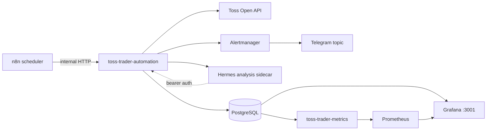
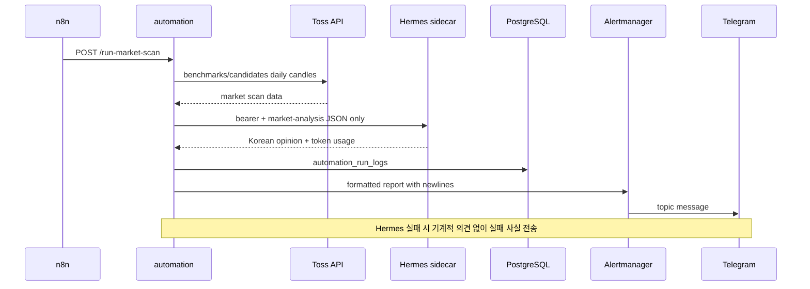
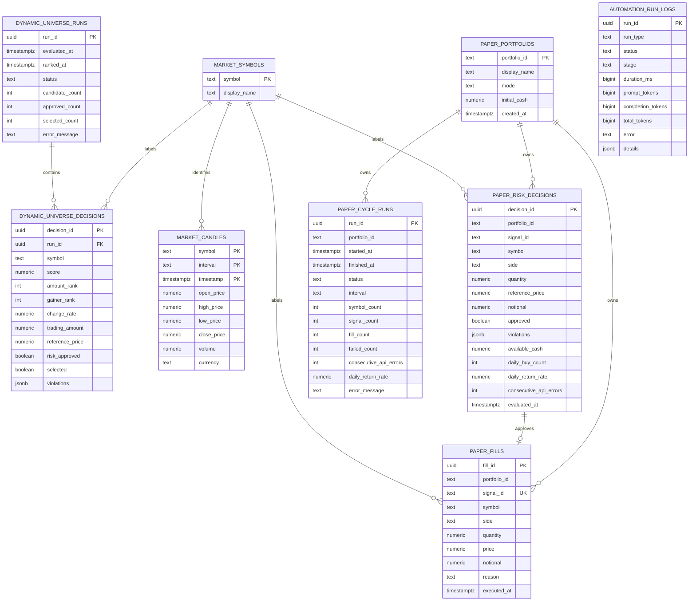

# Toss Trader workflow·ERD·파일 구조

## 운영 구성



- `automation`, `hermes-analysis`는 `openclaw-net` 내부에서만 통신한다.
- Hermes `8642`는 host port를 publish하지 않으며 Docker socket도 없다.
- Hermes API server의 toolset·plugin·MCP·context tool은 모두 0개다.
- 실제 주문 코드는 없고 모든 서비스에서 `TRADING_ENABLED=false`를 유지한다.

## 스케줄

| 시각(KST) | n8n workflow | endpoint | 역할 |
|---|---|---|---|
| 평일 08:30 | Market Analysis + Discovery | `/run-market-scan` | 시장·후보 JSON을 Hermes가 해석하고 Telegram 전송 |
| 평일 09:00~15:20, 5분 간격 | Intraday Paper Cycle | n8n rule→Hermes task | 동적 universe, 1분봉, 전략, RiskManager, paper 체결 |
| 평일 15:40 | Daily Paper + Hermes | n8n rule→Hermes→분석 task | 일봉 paper cycle, Hermes 마감 분석, Telegram 전송 |

## 장중 paper cycle

```mermaid
flowchart TD
    S[n8n 5분 trigger] --> API[POST /workflow/paper-rule-1m]
    API --> HAPI[POST /workflow/paper-hermes-1m]
    API --> U{최근 universe가\n30분 이내인가?}
    U -->|예| UC[선정 15종목 cache 사용]
    U -->|아니오| R1[거래대금 상위 30]
    U -->|아니오| R2[상승률 상위 30]
    R1 --> SCORE[거래대금 2배 + 상승률 1배 점수]
    R2 --> SCORE
    SCORE --> META[/stocks 회사·거래상태 batch 조회]
    META --> UR[RiskManager 후보 승인·거부]
    UR --> UL[(dynamic_universe_runs\ndynamic_universe_decisions)]
    UR --> PICK[승인 상위 15 + 보유 종목]
    UC --> C
    PICK --> C[종목별 /candles 61개 순차 조회]
    C -->|최소 0.25초 + rate-limit 대기| MC[(market_candles)]
    MC --> MA[MA20/MA60 계산]
    MA --> X{신호 조건}
    X -->|universe 갱신 + MA20 > MA60| B[최초 trend BUY]
    X -->|새 골든/데드크로스| CS[BUY/SELL]
    X -->|조건 없음| NS[신호 없음]
    B --> SPLIT{포트폴리오}
    CS --> SPLIT
    SPLIT -->|규칙 기반| RM[RiskManager 최종 판단]
    SPLIT -->|Hermes 개입| HA[Hermes 신호 승인·거부]
    HA --> AL[(automation_run_logs\n근거 + token)]
    HA --> RM
    RM --> RD[(paper_risk_decisions)]
    RM -->|승인| PF[(paper_fills)]
    RM -->|거부| NF[체결 없음]
    PF --> STATE[(paper_cycle_runs)]
    NF --> STATE
    NS --> STATE
    STATE --> OBS[Prometheus + Grafana]
    PF --> NOTICE[Alertmanager → Telegram 체결 알림]
```

RiskManager의 주요 제한:

- 주문당 최대 `300,000원`
- paper 가용 현금 초과 금지
- 종목 포지션 최대 `1,000,000원`
- 하루 BUY 최대 5건
- 동시 보유 최대 5종목
- 일일 수익률 `-3%` 이하 신규 체결 차단
- Toss API 연속 오류 5회 이상 차단
- 휴장일과 장 마감 10분 전 BUY 차단
- universe 갱신 실패 시 신규 BUY 차단, 보유 종목 SELL만 허용

## 시장분석·Hermes workflow



## PostgreSQL ERD



DB에서 강제하는 FK는 `dynamic_universe_decisions.run_id` 하나다. `symbol`과
`signal_id` 선은 Grafana 조회와 감사 추적에 사용하는 논리 관계다.
`paper_cycle_runs`와 `automation_run_logs`는 실행 단위 독립 장부다.

## 파일 구조

```text
toss-trader/
├── automation/
│   ├── hermes-analysis/       # zero-tool Hermes sidecar image/config
│   └── n8n/                   # 08:30, 장중 5분, 15:40 workflow JSON
├── docs/
│   ├── audit-ledgers.md       # 감사 장부와 조회 원칙
│   ├── automatic-trading-scenario.md
│   └── system-workflow.md     # 현재 문서
├── monitoring/
│   ├── alertmanager/          # Telegram receiver 설정
│   ├── grafana/               # Toss Trader dashboard/provisioning
│   └── prometheus/            # scrape·alert rules
├── src/toss_trader/
│   ├── automation.py          # HTTP endpoint, Hermes, Alertmanager, run log
│   ├── advisor.py             # Hermes 신호 승인/거부와 token·근거 감사
│   ├── calendar.py            # KR/US 장 일정
│   ├── cli.py                 # command 조립과 dependency wiring
│   ├── client.py              # Toss API, candle throttle/rate-limit
│   ├── config.py              # 환경 설정 검증
│   ├── cycle.py               # paper cycle orchestration
│   ├── cycle_state.py         # paper_cycle_runs
│   ├── execution.py           # Risk 판단 후 paper 체결
│   ├── market_data.py         # candle 수집과 저장 전략 adapter
│   ├── metrics.py             # PostgreSQL/SQLite → Prometheus
│   ├── models.py              # Candle, signal, fill model
│   ├── paper.py               # fill·Risk·automation 감사 장부
│   ├── portfolio.py           # 포지션·일일 수익률
│   ├── repository.py          # candle·회사명 repository
│   ├── risk.py                # RiskManager 정책
│   ├── screening.py           # 장전 시장분석·후보 발굴
│   ├── strategy.py            # MA 교차·trend entry 신호
│   └── universe.py            # 동적 universe 선정·감사
├── tests/                     # 모듈별 unittest
├── compose.yaml               # paper-only 운영 서비스
├── Dockerfile
└── pyproject.toml
```

secret 값은 `.env`, 문서, 로그, Git에 저장하지 않고 Infisical `prod`, path `/`에서
프로세스 실행 시 주입한다.
