# Toss Trader workflow·ERD·파일 구조

## 시스템 구성도

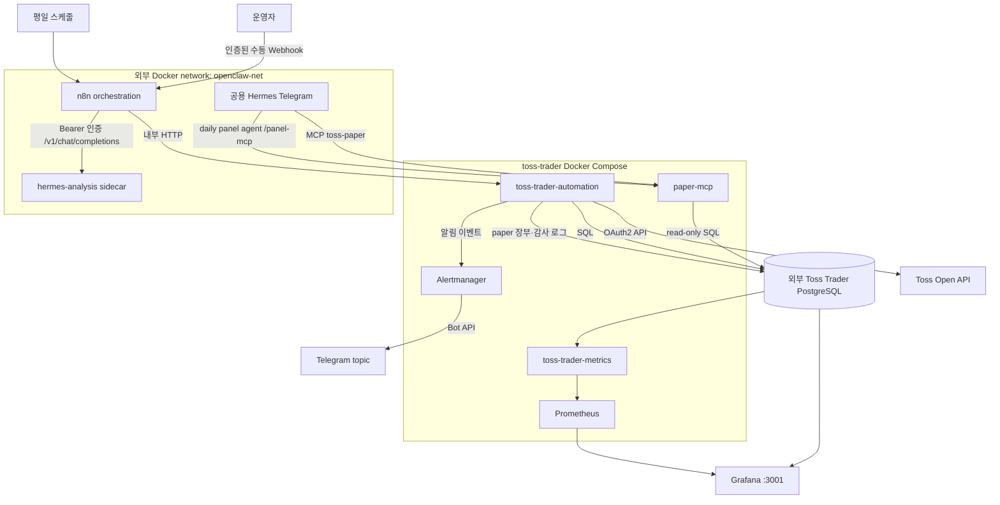

- `automation`, `hermes-analysis`, `paper-mcp`는 `openclaw-net` 내부에서 통신한다.
- `hermes-analysis`의 `8642`와 `paper-mcp`의 `8090`은 host port를 publish하지 않는다.
- 분석 sidecar는 Docker socket이 없고 toolset·plugin·MCP·context tool이 모두 0개다.
- 공용 Hermes Telegram과 그 컨테이너의 daily panel runner만 `paper-mcp`를
  사용한다. Cursor 패널 subprocess는 빈 임시 workspace에 `/panel-mcp` 한 개만
  받고, Telegram은 기존 `/mcp` 세 도구만 받는다. 상세는
  [`paper-mcp.md`](paper-mcp.md).
- 실제 주문 코드는 없고 모든 서비스에서 `TRADING_ENABLED=false`를 유지한다.
- 관측용 Grafana·Prometheus·metrics·Alertmanager는 운영망에서 조회할 수 있다.
  automation과 두 Hermes, paper-mcp는 host port를 publish하지 않는다.

## Docker Compose 구성도

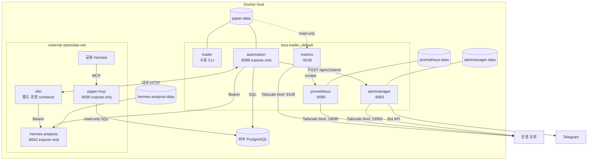

| 서비스 | network | volume | host publish | 역할 |
|---|---|---|---|---|
| `trader` | default | `paper-data` read/write | 없음 | 수동 CLI·개발용 one-shot 실행 |
| `automation` | default + `openclaw-net` | `paper-data` read/write | 없음 (`8088` expose) | n8n task, paper cycle, RiskManager callback, 알림 감사 |
| `paper-mcp` | `openclaw-net`만 | 없음 | 없음 (`8090` expose) | 공용 Hermes와 daily panel agent용 paper 장부 read-only MCP |
| `hermes-analysis` | `openclaw-net`만 | `hermes-analysis-data` | 없음 (`8642` expose) | zero-tool 분석 전용 LLM API |
| `metrics` | default | `paper-data` read-only | Tailscale `:9108` | Prometheus 지표·health. KR calendar `toss_trader_kr_intraday_cycle_expected` |
| `prometheus` | default | `prometheus-data` | Tailscale `:19090` | metrics scrape·alert rule 평가 |
| `alertmanager` | default | `alertmanager-data` | Tailscale `:19093` | Telegram topic 전달·실패 counter |

n8n, PostgreSQL, Grafana, 공용 Hermes는 이 compose가 생성하지 않는 기존 운영
구성이다. Grafana는 현재 운영 container에서 Prometheus·PostgreSQL을 datasource로
조회한다. compose의 `automation`은 default와 `openclaw-net`에 붙는 유일한
bridge다. 분석 sidecar `hermes-analysis`에는 Docker socket·host port·
tool/plugin/MCP/context tool이 없다. Telegram 질의용 MCP는 `paper-mcp`다.

## 스케줄

| 시각(KST) | n8n workflow | endpoint | 역할 |
|---|---|---|---|
| 평일 08:30 | Market Analysis + Discovery | `/workflow/market-scan` | 시장·후보 JSON을 Hermes가 해석하고 Telegram 전송 |
| 평일 09:00~15:20, 5분 간격 | Intraday Paper Cycle | n8n rule→Hermes task | 동적 universe, 1분봉, 전략, RiskManager, paper 체결 |
| 평일 11:50 | Daily Paper + Panel | n8n rule→Hermes→분석 queue | 장중 미완결 중간 브리핑(시세 대비), Telegram 전송 |
| 평일 15:40 | Daily Paper + Hermes | n8n rule→Hermes→분석 task | 일봉 paper, 시세 대비 마감 분석, Telegram 전송 |
| 매일 00:10·18:30 | pit-collector | 프로세스 타이머 | OpenDART 갱신. KIS 수급은 KR 정규장 날에만 |

세 n8n workflow의 schedule trigger는 본 작업 전에 `POST /workflow/market-session`으로 Toss
한국장 일정을 조회한다. `isBusinessDay=false`면 해당 execution을 정상 종료하고
cycle·스캔·Hermes·Telegram을 실행하지 않는다. Toss 일정 조회 오류도 fail-closed로
본 작업을 막는다. 중간·마감 workflow는 수동 trigger와 인증 webhook도 같은
calendar gate를 통과한다.

## API 구성도

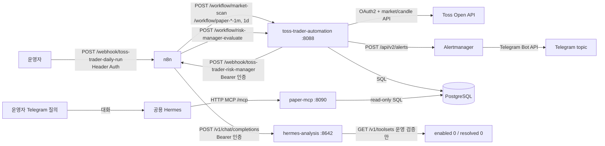

| 경계 | 호출 | 인증 | 용도 |
|---|---|---|---|
| 운영자 → n8n | `POST /webhook/toss-trader-daily-run` | 전용 bearer Header Auth | 15:40 마감 workflow를 비동기로 접수 |
| n8n → automation | `POST /workflow/*`, `GET /healthz` | `openclaw-net` 내부 통신 | 시장 스캔, rule/Hermes paper cycle, 리포트, 감사 로그 |
| automation → n8n | `POST /webhook/toss-trader-risk-manager` | 전용 bearer Header Auth | RiskManager sub-workflow 요청 |
| n8n → Hermes | `POST /v1/chat/completions` | Hermes bearer | 시장분석 JSON 또는 paper 비교 JSON 해석 |
| 운영 검증 → Hermes | `GET /v1/toolsets` | Hermes bearer | enabled/resolved tool이 모두 0인지 확인 |
| 운영자 Telegram → 공용 Hermes | 대화 | 공용 Hermes Telegram 세션 | paper 진행·보유·손익 질의 |
| 공용 Hermes → paper-mcp | `POST /mcp` | `openclaw-net` 내부 | 현황·보유·손익 3개 도구 |
| daily panel agent → paper-mcp | `POST /panel-mcp` | `openclaw-net` 내부 | panel cutoff 고정 근거 도구 1개 |
| paper-mcp → PostgreSQL | 고정 SELECT | DB 계정, session read-only | `rule`/`hermes` paper 장부 조회 |
| automation → Toss | OAuth2 token·시장·캔들 API | Toss OAuth2 credential | 조회 전용 시장 데이터 수집 |
| automation → Alertmanager | `POST /api/v2/alerts` | 내부망 | 성공·실패·paper 체결 이벤트 전달 |
| Alertmanager → Telegram | Telegram Bot API | bot credential | 지정 topic에 리포트·장애 알림 전송 |

`/workflow/*`, 분석 sidecar `:8642`, `paper-mcp` `:8090`은 외부에 공개하지 않는다. n8n의 수동 webhook만
전용 bearer credential을 통과한 요청을 받고 즉시 접수 응답한다. 모든 bearer 값과
OAuth2 credential은 Infisical에서 n8n encrypted credential 또는 프로세스 환경으로
주입하며, workflow JSON·로그·Git에는 저장하지 않는다.

## API별 flow

모든 n8n HTTP node는 `_workflow`에 workflow/execution/stage/portfolio/interval을
넣는다. automation은 이 메타데이터와 결과 집계만 `automation_run_logs`에 기록하고,
요청 body·bearer·전체 Hermes prompt/response는 기록하지 않는다.

### 1. 수동 마감 Webhook

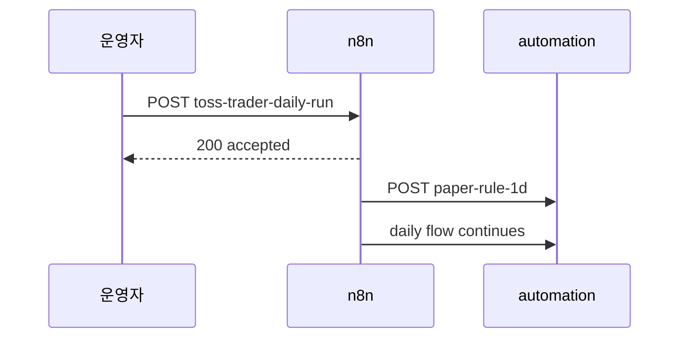

Webhook은 접수만 비동기로 반환한다. 완료 여부는 n8n execution과 후속
`automation_run_logs`로 확인한다.

### 2. 장전 시장분석·종목발굴

08:30 스캔은 `DISCOVERY_SYMBOLS`의 setup-v2.3 평가다. 장중 Rule D-1 유니버스,
Hermes Top30, Hunter 10:01 창과 분모가 다르다. 보고 JSON은 Rule 승인과
Hermes 실험 후보를 나눈다.

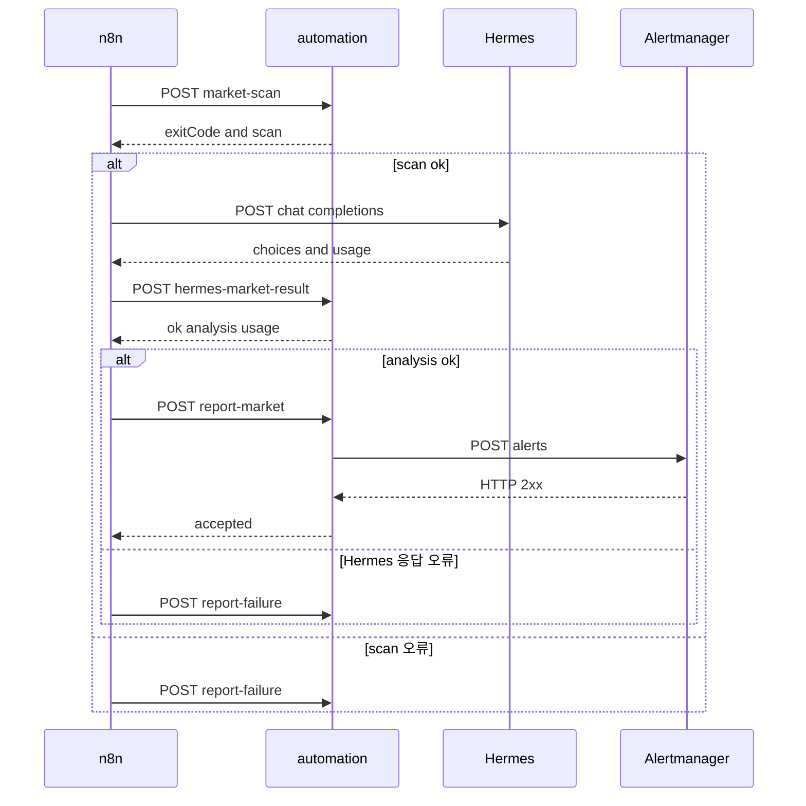

### 3. 장중 1분봉 rule/Hermes 비교

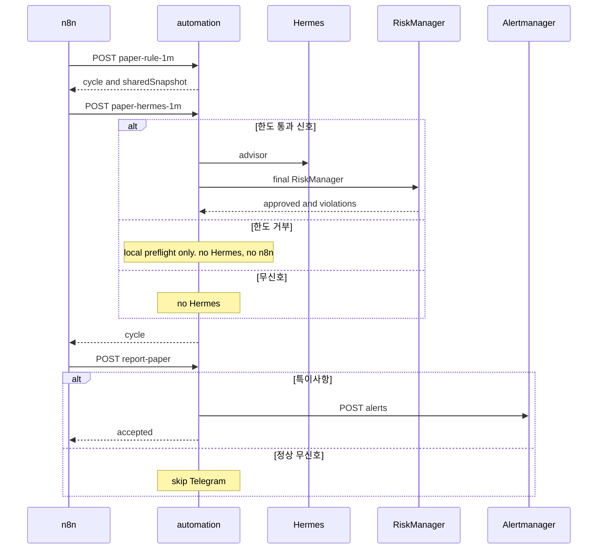

rule·Hermes는 `sharedSnapshot` 공유. candle 1회. `exitCode=3` = partial, Telegram `warning`.

### 4. 마감 일봉·Hermes 분석

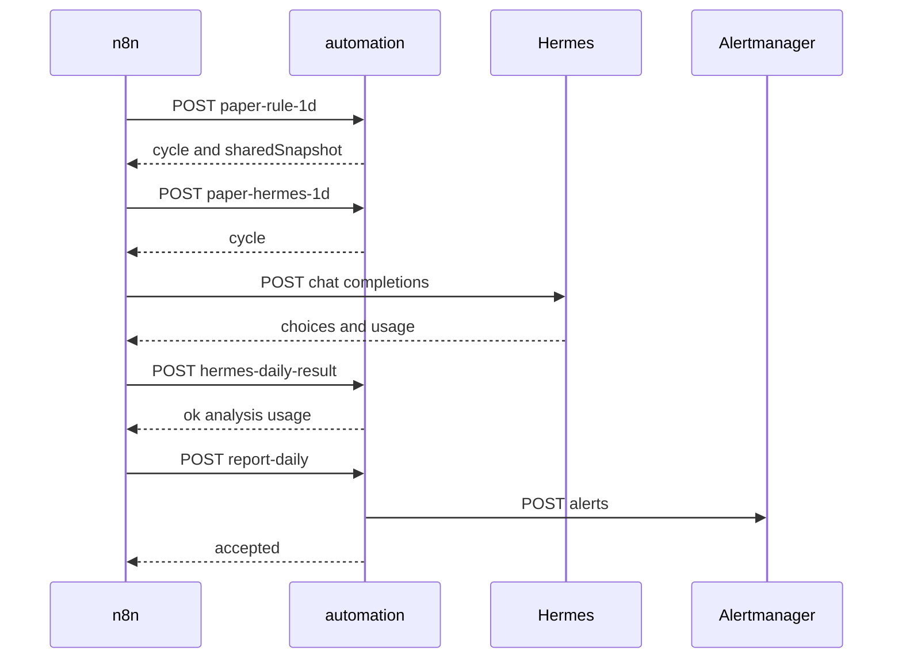

rule cycle, Hermes cycle, Hermes 응답 검증, Telegram 각 단계가 실패하면 다음 정상
단계로 진행하지 않고 `/workflow/report-failure`로 분기한다.

### 5. RiskManager sub-workflow

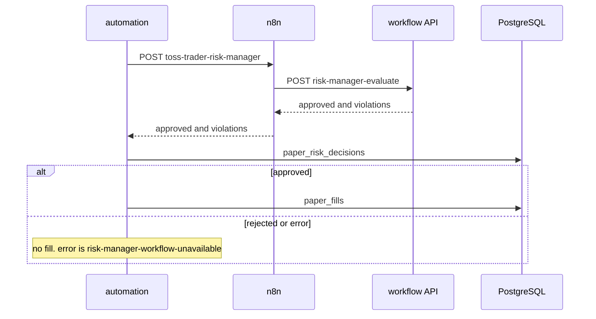

Hermes 한도 거부는 webhook 전 로컬 preflight라 n8n을 호출하지 않는다. universe
정적 membership도 로컬 순수 검증으로 처리한다. Rule/Hermes의 실제 BUY·SELL만
n8n RiskManager 경로를 사용한다.

### 6. 공통 failure·운영 검증

| API | 성공 응답/판단 | 실패 처리·감사 |
|---|---|---|
| `POST /workflow/market-session` | Toss 한국장 `businessDate`, `isBusinessDay`, 정규장 시작·종료 시각 | n8n이 최대 3회 재시도; 실패 또는 휴장이면 scheduled 본 작업 미실행 |
| `POST /workflow/report-failure` | Alertmanager `{accepted: true}` | Telegram에는 workflow·execution·stage·종목 오류 최대 5건만 요약. 원본 n8n 응답은 execution에, compact detail은 audit에 남김 |
| `GET /healthz` | `200 {"status":"ok"}` | service healthcheck와 n8n 운영 점검에 사용 |
| `GET /v1/toolsets` | enabled tool 0, resolved tool 0 | Hermes healthcheck가 실패하면 container unhealthy |
| Toss OAuth2/market/candle API | 조회 데이터 | 종목별 오류는 cycle에 기록; 나머지 종목은 계속. 연속 오류 5회면 RiskManager가 차단 |
| `POST /api/v2/alerts` | Alertmanager accepted | automation은 `502`를 반환하고 n8n failure flow가 기록 |

## 장중 paper cycle

신호·진입·청산의 canonical 상태기계는
[`paper-cycle-flow.md`](paper-cycle-flow.md)를 따른다.

```mermaid
flowchart TD
    S[n8n 5분 trigger] --> API[POST /workflow/paper-rule-1m]
    API --> HAPI[POST /workflow/paper-hermes-1m]
    API --> U{오늘 성공한\nuniverse가 있는가?}
    U -->|예| UC[D-1 setup-first 당일 cache\n정상 0종 포함]
    U -->|아니오| R1[08:35 KRX D-1 실제 조회 ∩ market_symbols\n전일 거래대금·종가]
    R1 --> META[/stocks metadata batch 조회]
    META --> STATIC[STOCK·보통주·ACTIVE·거래정상]
    STATIC --> PRICE[전체 직전 완결 일봉 200개\n가격·PIT·이벤트 우선 평가]
    PRICE --> UR[통과자 거래대금 재랭크\n최대 15·미충원]
    UR --> UL[(dynamic_universe_runs\ndynamic_universe_decisions)]
    UR --> PICK[승인 상위 15까지 + 보유 종목\n부족분 채움 없음]
    UC --> C
    PICK --> C[종목별 1m + 완결 일봉 200개 순차 조회]
    C -->|최소 0.25초 + rate-limit 대기| MC[(market_candles)]
    MC --> PIT[(PostgreSQL PIT<br/>수급 6세션 + 이벤트)]
    PIT --> X{전일 setup-v2.3 승인 +<br/>D+1 첫 완결봉 arm?}
    X -->|신규 entry| B[위험 수량 BUY]
    X -->|보유 stop/structure exit| CS[SELL]
    X -->|누락·대기·조건 없음| NS[skip / v2 idle]
    B --> SPLIT{포트폴리오}
    CS --> SPLIT
    SPLIT -->|규칙 기반| RM[n8n RiskManager 최종 판단]
    SPLIT -->|Hermes 개입| PRE{hard 한도\n로컬 preflight}
    PRE -->|거부| RD
    PRE -->|통과| HA[Hermes 신호 승인·거부]
    HA --> AL[(automation_run_logs\n근거 + token)]
    HA --> RM
    RM --> RD[(paper_risk_decisions)]
    RM -->|승인| PF[(paper_fills)]
    RM -->|거부| NF[체결 없음]
    PF --> STATE[(paper_cycle_runs)]
    NF --> STATE
    NS --> STATE
    STATE --> OBS[Prometheus + Grafana]
    PF --> NOTICE[Alertmanager → Telegram 체결 알림]
```

RiskManager의 주요 제한:

- 주문당 최대 `700,000원`
- paper 가용 현금 초과 금지
- 종목 포지션 최대 `1,000,000원`
- 하루 BUY 최대 5건
- 동시 보유 최대 10종목
- 일일 수익률 `-3%` 이하 신규 체결 차단
- Toss API 연속 오류 5회 이상 차단
- 휴장일과 장 마감 10분 전 BUY 차단
- universe 갱신 실패 시 신규 BUY 차단, 보유 종목 SELL만 허용

## RiskManager process

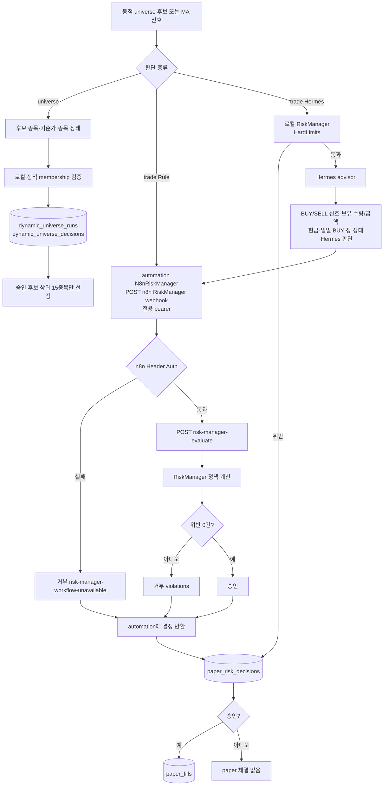

| 구분 | 평가 입력 | 거부 조건 | 기록 결과 |
|---|---|---|---|
| `universe` | 종목 유형·보통주 여부·거래 상태·정지 여부·기준가 | 로컬 검증: 비주식/우선주, 비활성·정지, 가격 오류 | `dynamic_universe_decisions`에 후보별 raw/eligible rank·승인·위반·선정 여부. n8n 호출 없음 |
| `trade` | 신호·포지션·현금·장 상태·Hermes | Hermes: 로컬 한도 먼저. 통과 후 advisor+n8n. `RECLAIM_LOST`는 Hunter만. Rule: n8n 1회 | 판단은 `paper_risk_decisions`. 승인만 fill. 한도 거부는 `hermes_trade` 없음 |

RiskManager는 추천·실주문을 하지 않는다. timeout·인증·JSON 오류는 모두
`risk-manager-workflow-unavailable`로 체결 차단. parent/child execution ID와
`decision_id`는 `automation_run_logs`에서 본다.

## 시장분석·Hermes workflow

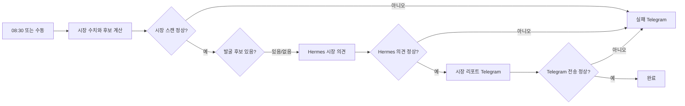

장중·마감: `Snapshot+Rule → Hermes`. candle·원시 신호 1회, 15종목이면 candle 15회.
포트폴리오별 판단·체결만 분리. Hermes advisor는 한도 통과 신호만.
마감은 병합 뒤 Hermes 분석·Telegram 성공을 추가로 본다.
HTTP 응답 오류 → 해당 단계 실패 Telegram. timeout 등 무응답 → `Toss Trader Workflow Error Reporter`.

`_workflow` 메타만 `automation_run_logs(run_type='n8n_flow')`에 남김. body 복제 없음.
Grafana `n8n Flow Review Log`로 단계·token·Telegram·decision ID 조회.

RiskManager: n8n webhook → `/workflow/risk-manager-evaluate`. Header Auth 필수.
fail-closed. 오류 = `risk-manager-workflow-unavailable`. Hermes 한도 거부는 n8n child 없음.

Hermes는 n8n이 sidecar 직접 호출. automation은 응답 검증·token audit·리포트만.
실패 시 기계적 의견 없이 실패 경로로 종료.

### n8n credential과 Infisical

n8n Community license에는 native External Secrets entitlement가 없으므로
`automation/n8n/sync-infisical-credentials.sh`가 Infisical `prod`, `/`에서
필요한 값만 읽어 n8n encrypted credential DB로 동기화한다. workflow JSON에는
credential ID만 저장한다.

- `toss-trader-hermes-auth`: Hermes bearer Header Auth
- `toss-trader-toss-oauth2`: Toss Client Credentials OAuth2. 동기화는 하지만 현재
  workflow JSON의 HTTP node가 직접 사용하지 않는 예약 credential
- `toss-trader-risk-manager-auth`: RiskManager webhook bearer Header Auth
- `toss-trader-manual-trigger-auth`: 수동 workflow 실행용 bearer Header Auth

스크립트는 repo `.env`의 machine identity를 사용한다. access token과 secret은
shell memory와 pipe로만 전달하며 plaintext credential 파일을 host에 만들지 않는다.
Infisical 값 교체 후 스크립트를 다시 실행하면 같은 ID의 credential을 갱신한다.

마감 리뷰 수동 실행은 실행 중인 n8n 컨테이너에서 `n8n execute`를 추가로 띄우지
않는다. 인증된 `POST /webhook/toss-trader-daily-run`을 호출한다. 운영 n8n의 Task
Broker `5679`와 충돌하지 않으며, 기존 15:40 schedule과 같은 첫 단계로 합류한다.
`automation/n8n/run-daily-webhook.sh`는 Infisical에서 전용 token을 읽어 HTTP header
stdin으로만 전달한다. token을 command argument나 host 파일에 기록하지 않는다.
Webhook은 reverse proxy timeout을 피하도록 접수 즉시 응답한다. 실제 성공 여부는
n8n execution, `automation_run_logs`, Hermes token 기록, Telegram 수신으로 확인한다.

## PostgreSQL ERD

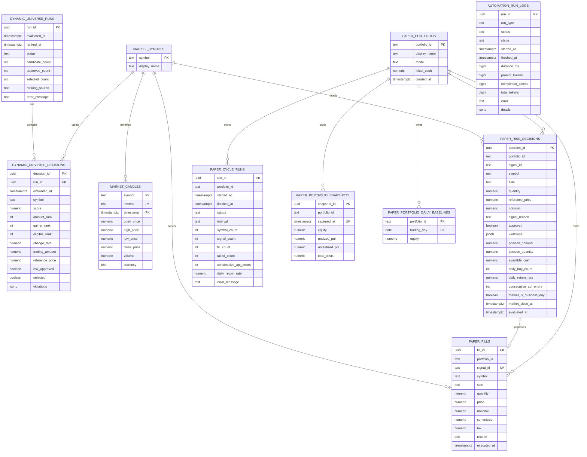

DB에서 강제하는 FK는 `dynamic_universe_decisions.run_id` 하나다. `symbol`과
`signal_id` 선은 Grafana 조회와 감사 추적에 사용하는 논리 관계다.
`paper_cycle_runs`와 `automation_run_logs`는 독립 장부. 단일 통화
`daily_return_rate`는 UTC 일자 시작 총자산 대비 비용 반영 총자산 수익률이다.
`automation_run_logs.details` JSONB에는 `workflowId`, `executionId`, `trigger`,
`portfolioId`, `interval`, `parentExecutionId`, `telegramAccepted`, `riskDecisionIds` 등
workflow 감사 메타데이터가 들어가며, 별도 DB column이나 FK가 아니다.

### n8n workflow ID mapping

| 구분 | n8n DB `workflowId` | `automation_run_logs.details.workflowId` |
|---|---|---|
| 장전 시장분석 | `toss-trader-market-scan` | `toss-trader-market-scan` |
| 장중 paper 비교 | `toss-trader-intraday-paper` | `toss-trader-intraday-paper` |
| 마감 paper/Hermes | `toss-trader-daily-paper-hermes` | `toss-trader-daily` |
| RiskManager sub-workflow | `toss-trader-risk-manager` | `toss-trader-risk-manager` |

마감 workflow만 n8n 저장 ID와 automation audit ID가 다르다. n8n 실행 조회는 전자를,
Grafana `n8n Flow Review Log` 조회는 후자를 사용한다.

## 파일 구조

```text
toss-trader/
├── automation/
│   ├── hermes-analysis/       # zero-tool Hermes sidecar image/config
│   └── n8n/
│       ├── toss-trader-market-scan.json
│       ├── toss-trader-intraday-paper.json
│       ├── toss-trader-daily.json
│       ├── toss-trader-risk-manager.json
│       ├── toss-trader-error.json
│       ├── sync-infisical-credentials.sh
│       └── run-daily-webhook.sh
├── docs/
│   ├── audit-ledgers.md       # 감사 장부와 조회 원칙
│   ├── automatic-trading-scenario.md
│   ├── backtesting.md         # MA 백테스트 체결 가정
│   ├── changelog.md           # 날짜별 기능 추가
│   ├── operations-runbook.md  # 수동 실행·장애 대응·운영 검증
│   ├── paper-mcp.md           # 공용 Hermes Telegram paper 조회 MCP
│   ├── pnl-engine.md          # 이동평균 원가·손익
│   ├── system-workflow.md     # 현재 문서
│   └── validation-history.md  # 과거 검증 snapshot
├── monitoring/
│   ├── alertmanager/          # Telegram receiver 설정
│   ├── grafana/               # Toss Trader dashboard/provisioning
│   └── prometheus/            # scrape·alert rules
├── src/toss_trader/
│   ├── automation.py          # HTTP endpoint, Hermes, Alertmanager, run log
│   ├── advisor.py             # Hermes 신호 승인/거부와 token·근거 감사
│   ├── calendar.py            # KR/US 장 일정
│   ├── cli.py                 # command 조립과 dependency wiring
│   ├── client.py              # Toss API, candle throttle/rate-limit
│   ├── config.py              # 환경 설정 검증
│   ├── cycle.py               # paper cycle orchestration
│   ├── cycle_state.py         # paper_cycle_runs
│   ├── errors.py              # Toss API 오류 model
│   ├── execution.py           # Risk 판단 후 paper 체결
│   ├── market_data.py         # candle 수집과 저장 전략 adapter
│   ├── metrics.py             # PostgreSQL/SQLite → Prometheus
│   ├── models.py              # Candle, signal, fill model
│   ├── paper.py               # fill·Risk·automation 감사 장부
│   ├── paper_mcp.py           # Telegram용 read-only paper MCP
│   ├── portfolio.py           # 포지션·일일 수익률
│   ├── repository.py          # candle·회사명 repository
│   ├── risk.py                # RiskManager 정책
│   ├── screening.py           # 장전 시장분석·후보 발굴
│   ├── strategy.py            # MA 교차·trend entry·continuation 신호
│   └── universe.py            # 동적 universe 선정·감사
├── tests/                     # 모듈별 unittest
├── compose.yaml               # paper-only 운영 서비스
├── Dockerfile
└── pyproject.toml
```

secret 값은 `.env`, 문서, 로그, Git에 저장하지 않고 Infisical `prod`, path `/`에서
프로세스 실행 시 주입한다.
